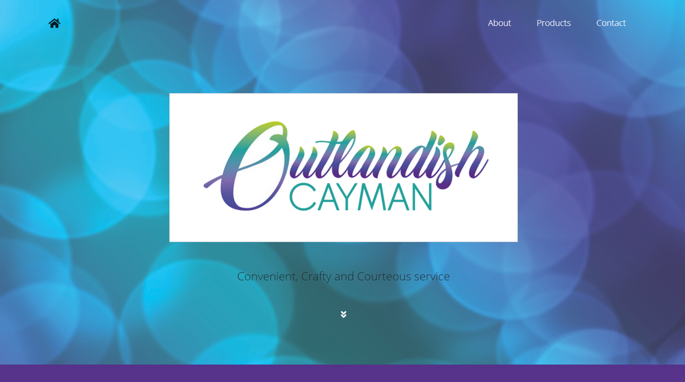

# Outlandish-Cayman

As part of my second Web Design assignment, this project is the final website design for Outlandish Cayman - a company based in the Cayman Islands. 

This website was built using a Gatsby starter + react and was based off of Gatsby.js V2 starter template /gatsby-starter-grayscale/ by Anubhav Srivastava. 

This site is also hosted by Netlify CMS and online preview available [here](https://outlandishcayman.netlify.app/)

## Screenshot

### Portfolio

Tynisha Ebanks online portfolio preview [here](https://tyebanks.github.io/)
